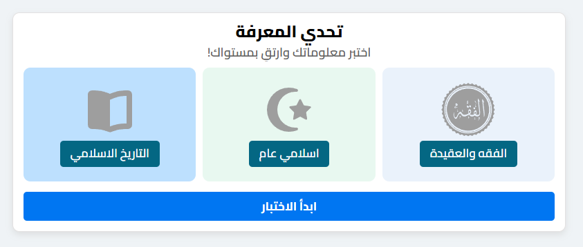
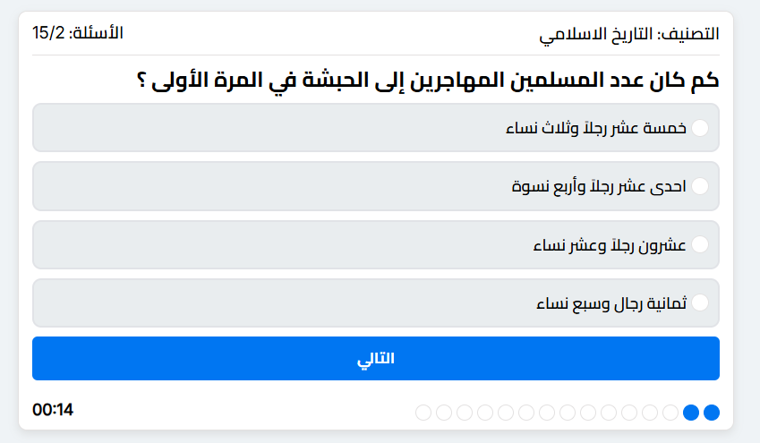
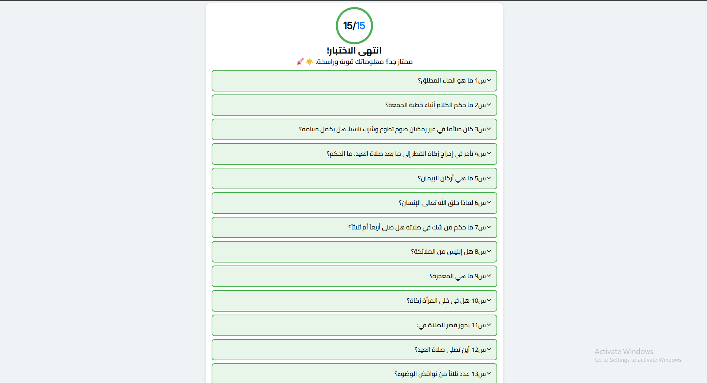

# 🧩 Quiz App

A responsive quiz application built with **HTML, CSS, and Vanilla JavaScript**.

Players choose a category, answer 15 randomly selected questions with a 15-second countdown for each question, and receive a final score with a detailed answer review.

The quiz content is stored in JSON files, making it easy to add new categories and questions without modifying the core quiz logic.

---

## 🎮 Live Demo

🔗 _Add your live demo link here_

---

## ✨ Features

- Multiple quiz categories with custom inline SVG icons
- 15 randomly selected questions per quiz
- Partial Fisher–Yates shuffle for unbiased question selection without repetition
- Answers shuffled independently for each selected question
- 15-second countdown for every question
- Automatically moves to the next question when the timer expires
- Progress indicator for the quiz
- Final score with an animated percentage ring using pure CSS
- Detailed answer review showing:
  - The player's answer
  - The correct answer when the player's answer is wrong
- Expandable answer review using native `<details>` and `<summary>`
- Fully right-to-left (RTL) Arabic interface
- Data-driven question system using JSON files
- Categories and quiz data are loaded dynamically

---

## 🛠 Technologies Used

- **HTML5**
  - Semantic HTML
  - Native `<details>` / `<summary>`

- **CSS3**
  - CSS Custom Properties
  - `clamp()`
  - `:has()`
  - `conic-gradient()`
  - CSS animations
  - Responsive layout with Flexbox

- **JavaScript**
  - Vanilla JavaScript
  - ES Modules
  - `fetch()`
  - JSON Import Attributes
  - `async/await`
  - DOM manipulation
  - `DocumentFragment`
  - `structuredClone()`
  - `requestAnimationFrame()`

---

## 🎯 How Question Selection Works

Each category can contain more questions than the 15 used in a single quiz.

Instead of shuffling the entire question array and then taking the first 15 questions, the app uses a **partial Fisher–Yates shuffle**.

Only the required number of positions are randomized, allowing the app to select 15 unique questions without fully shuffling the entire dataset.

The original question data is not modified.

Answers for each selected question are then shuffled independently before being displayed.

---

## 📊 Quiz Flow

1. The player selects a category.
2. The corresponding JSON file is loaded.
3. 15 unique questions are randomly selected.
4. The answers for each question are shuffled.
5. The quiz starts with a 15-second countdown.
6. The player submits an answer or the timer expires.
7. The app records the result and moves to the next question.
8. After the final question, the score is calculated.
9. The player can review all answers on the results screen.

---

## 📁 Project Structure

```text
Quiz-App/
│
├── data/
│   ├── categories.json
│   ├── faith_law.json
│   ├── islamic_history.json
│   ├── islamic.json
│   └── ...
│
├── screenshots/
│   ├── start.png
│   ├── quiz.png
│   └── results.png
│
├── favicon.svg
├── .editorconfig
├── index.html
├── main.js
└── master.css
```

---

## 🗂 Data Format

Categories are registered in `categories.json`:

```json
{
  "logicalName": "islamic_history",
  "uiName": "التاريخ الإسلامي"
}
```

Each category has its own JSON file:

```text
data/islamic_history.json
```

Example:

```json
{
  "category": "التاريخ الإسلامي",
  "questions": [
    {
      "id": 1,
      "question": "...",
      "answers": [
        {
          "text": "...",
          "isCorrect": true
        },
        {
          "text": "...",
          "isCorrect": false
        }
      ]
    }
  ]
}
```

Each category should contain at least **15 questions**, since the application selects 15 questions for every quiz.

---

## 🚀 How to Run

1. Clone the repository.

```bash
git clone https://github.com/basosytech/Basosy-quiz-app.git
```

2. Open the project folder.
3. Run the project using a local development server such as **VS Code Live Server**.

> A local server is recommended because the application loads JSON files using `fetch()`.

---

## 📷 Screenshots

### Start Screen



### Quiz Screen



### Results Screen



---

## 📄 License

This project is for learning and portfolio purposes.

---

## 👨‍💻 Author

**Abdo (BasosyTech)**

- GitHub: [@BasosyTech](https://github.com/basosytech)
